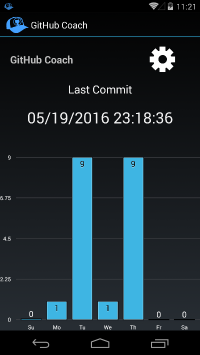
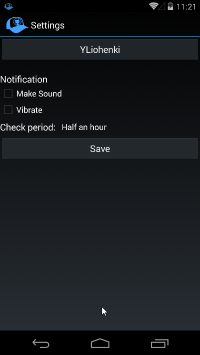
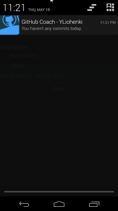

# GitHub Contribute Notifier
Github Contribute Notifier is an android app to help you keep your commits streak. Build with Xamarin. Check out project's page: http://www.liohenki.com/Projects/GitHubContributeNotifier . Google play page: https://play.google.com/store/apps/details?id=com.YLiohenki.AndroidGitHubContributeNotifier .

It shows your commits for last month/week and how long is your current streak. It also shows notification after 2 PM, if you have not any commits today yet.

## Installation

~~Currently you have to build it yourself with Xamarin. Going to resolve it soon.~~

Download it from google play: https://play.google.com/store/apps/details?id=com.YLiohenki.AndroidGitHubContributeNotifier .

## What's being used

Xamarin (without Xamarin.Forms)
BarChart for Xamarin https://components.xamarin.com/view/barchart

