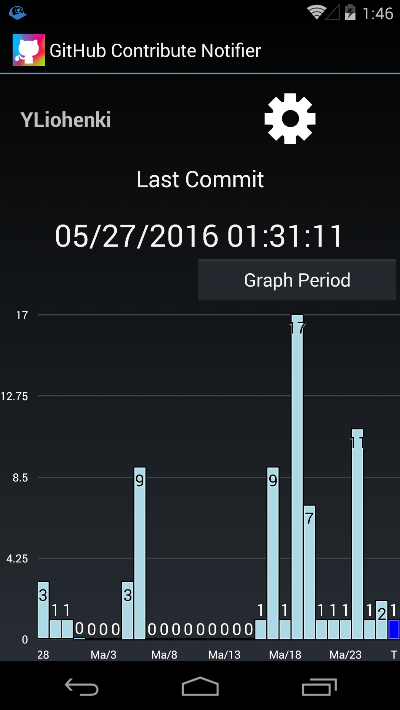

# GitHub Contribute Notifier
Github Contribute Notifier is an android app to help you keep your commits streak. Check out project's page: http://www.liohenki.com/Projects/GitHubContributeNotifier .

It shows your commits for last month/week and how long is your current streak. It also shows notification after 2 PM, if you haven't commit today yet.

## Installation

Currently you have to build it yourself with Xamarin. Going to resolve soon.

## What's being used

Xamarin (without Xamarin.Forms)

